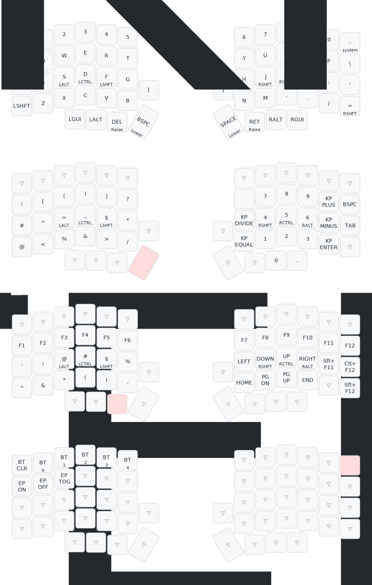

# Lily58-Nicenano Config

Configure with [zmk studio](https://zmk.studio/)

# Deprecated

When this repo was first created it required manual changes to update mappings. Then it was updated to support mapping with the visual configuration tool (linked below).
Since then, ZMK has been enabled in this mapping so changes are only required here for advanced features.

## Visual Configuration tool

<https://nickcoutsos.github.io/keymap-editor/>

---

## Map

```

```

> Drawn with [Keymap Drawer](/caksoylar/keymap-drawer)
