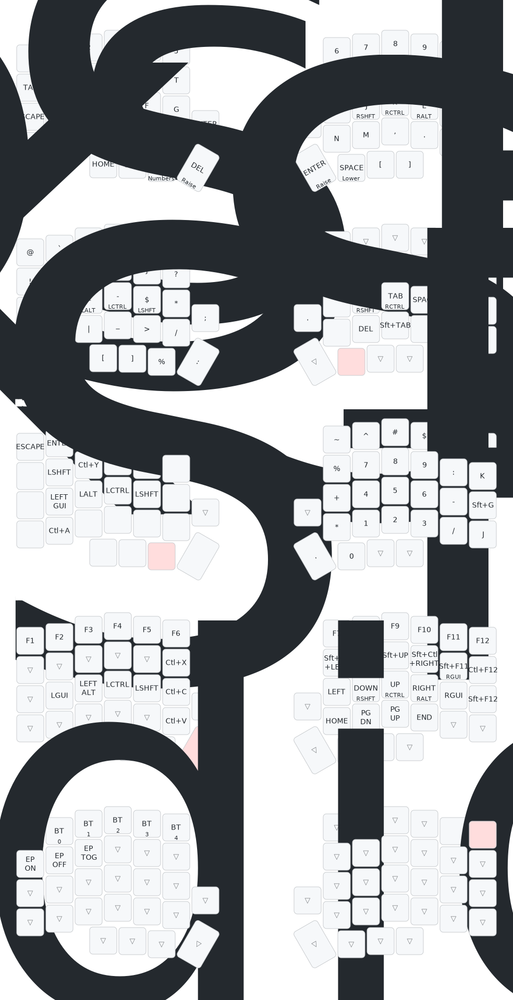

# Lily58-Nicenano Config

# Deprecated

Prior to enabling ZMK studio mapping was done manually, then mapping was done with the visual configuration tool. This repository is now deprecated as ZMK has been enabled for mapping.
These are no longer needed because of ZMK studio. Manual at the time of this update is still required for advanced features. However this is a good trade off IMO for the convenience of remapping faster.

## Visual Configuration tool

<https://nickcoutsos.github.io/keymap-editor/>

---

## Map

```

```

> Drawn with [Keymap Drawer](/caksoylar/keymap-drawer)
